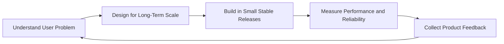

## Full-Stack Web Developer

### Building production-ready web products with clean architecture, performance, and strong UX.

---

## Executive Summary

Full-stack engineer with a product mindset, focused on delivering web applications that are fast, reliable, and built for long-term evolution.
I work across frontend and backend systems to turn business requirements into production-ready software with clear architecture and measurable user value.

I bring three consistent strengths to every build:

- Product-aware engineering: translating goals into practical technical decisions.
- Clean scalable architecture: maintainable code, modular structure, and strong API boundaries.
- Delivery discipline: performance-focused implementation, testing-conscious development, and dependable execution.

| Area | Details |
| --- | --- |
| Role | Full-Stack Engineer |
| Focus | Product-grade web applications |
| Core Expertise | React, TypeScript, Node.js, Express, database-backed systems |
| Engineering Priorities | Scalability, maintainability, performance, DX |
| Current Growth | Advanced React patterns, system design, DSA |
| Collaboration | Open to impactful product and engineering work |

## Technical Expertise

**Frontend Engineering**

`React` `TypeScript` `JavaScript` `Tailwind CSS` `Vite` `EJS`

**Backend Engineering**

`Node.js` `Express` `Django`

**Database Systems**

`MongoDB` `PostgreSQL` `MySQL` `Mongoose`

**Programming Languages**

`TypeScript` `JavaScript` `Python` `Java` `C`

**Cloud, Deployment, and Tooling**

`Git` `GitHub` `NPM` `Vercel` `Render` `Railway`

## Current Engineering Priorities

- Designing reusable frontend systems with strong type safety.
- Building clean and scalable backend services for production.
- Improving system design decisions for long-term maintainability.

## Signature Engineering System

  
<strong>Execution Playbook</strong> (how I turn requirements into production outcomes)

- Scope first: convert business goals into measurable software outcomes.
- Design second: choose patterns that reduce complexity over time.
- Ship fast: release in small increments with clear rollback safety.
- Verify always: monitor speed, errors, and user behavior after release.
- Improve continuously: use feedback loops, not one-time assumptions.

## GitHub Analytics

  
  

  

  

## Professional Profiles

  
  
  
  

---

Focused on quality engineering, product thinking, and long-term impact.

